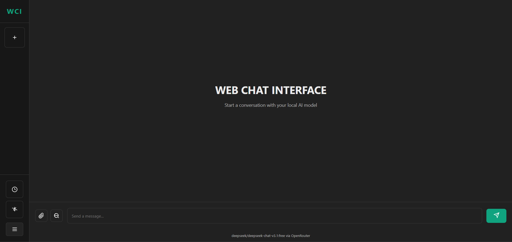
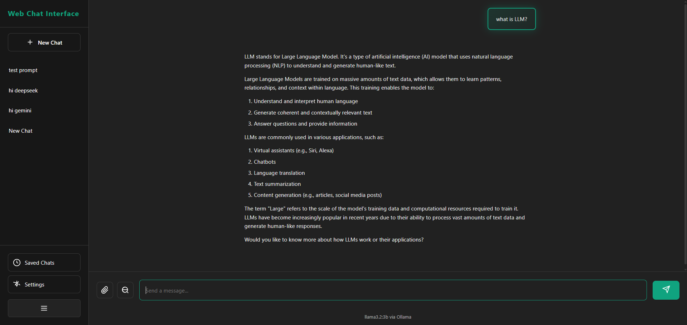
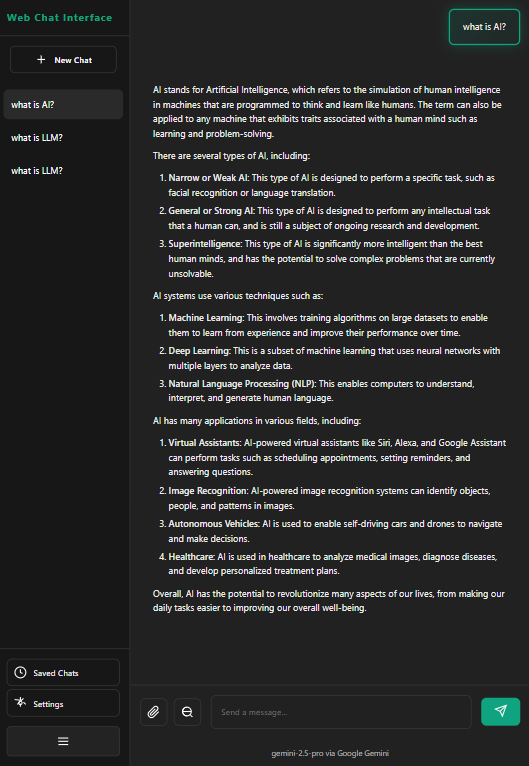
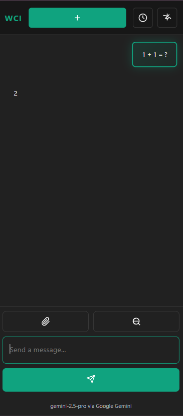

# 🌐 Web Chat Interface (WCI)

Modern, responsive web chat interface for multiple AI providers including Ollama, Google Gemini, and OpenRouter.



## ✨ Features

- 💬 **Multi-Provider Support** - Chat with Ollama (local), Google Gemini, or OpenRouter
- 🖼️ **Image Upload & Vision** - Upload images and analyze them with AI (Ollama llava, Gemini Vision, Claude 3)
- 🎨 **HTML Preview** - Live preview of HTML code with sandboxed iframe
- 💾 **Smart Chat History** - Auto-save conversations with metadata (date, model, provider)
- 🔄 **Dynamic Model Loading** - Auto-detect and switch between models
- 📱 **Fully Responsive** - Optimized layouts for desktop, tablet, and mobile
- 🌙 **Dark Theme** - Beautiful, modern dark UI with gradient accents
- 📝 **Rich Markdown** - Full markdown rendering with syntax highlighting
- 🎯 **Code Block Tools** - Copy, preview buttons with language detection
- ⚡ **Streaming Responses** - Real-time AI responses with Ollama
- 🔒 **Privacy First** - Local storage, no external tracking
- ⚡ **Modular Architecture** - Clean, maintainable codebase

## 🚀 Quick Start

### Prerequisites

1. **Node.js** (v18 or higher)
2. **Ollama** (optional, for local models) - [Install Ollama](https://ollama.ai)
3. **API Keys** (optional):
   - Google Gemini: [Get API Key](https://makersuite.google.com/app/apikey)
   - OpenRouter: [Get API Key](https://openrouter.ai/keys)

### Clone from GitHub
Clone the project fies from github.com
```bash
git clone https://github.com/ahmetefe37/web-chat-interface.git
```

### Installation
Set the directory
```bash
cd web-chat-interface
```

### Install dependencies
Install all dependencies for the project
```bash
npm install
```


### Start the server
```bash
npm start
```

The server will start at `http://localhost:5000`

### For Ollama Users
Start Ollama (in separate terminal)
```bash
ollama serve
```

Pull a model
```bash
ollama pull llama3.2
```

or

```bash
ollama pull mistral
```

For vision/image analysis (optional)
```bash
ollama pull llava
```

### Development Mode
Auto-restart on file changes
```bash
npm run dev
```

## 🎯 Usage

### Provider Setup

1. **Open Settings (⚙️)**
2. **Select Provider**:
   - **Ollama**: For local models (free, private)
   - **Google Gemini**: For Gemini models (API key required)
   - **OpenRouter**: For multiple models (API key required)
3. **Configure**:
   - Enter API key (if needed)
   - Select model
   - Adjust temperature (0-1)
4. **Save Settings**

### Chat Features

- **New Chat**: Click `+` button or "New Chat"
- **Auto-Save**: Conversations save automatically
- **Multiple Chats**: Switch between different conversations
- **Chat History**: View and manage saved chats
- **Image Upload**: Click 📷 button to attach images to your messages
- **Vision Analysis**: AI can analyze and describe uploaded images

### Code Features

**HTML Preview**:
1. AI generates HTML code
2. Click `Preview` button on code header
3. See live preview in modal

**Copy Code**:
1. Hover over code block
2. Click `Copy` button
3. Code copied to clipboard

### Image Features

**Upload & Analyze Images**:
1. Click the 📷 (image) button in input area
2. Select an image file (JPG, PNG, GIF, WebP)
3. Preview appears above input
4. Type your question about the image (optional)
5. Send to AI for analysis

**Supported Vision Models**:
- **Ollama**: llava, bakllava (local vision models)
- **Gemini**: gemini-2.5-pro, gemini-2.5-flash-image
- **OpenRouter**: Claude 3, GPT-4 Vision, and other vision models

**Features**:
- Image preview before sending
- Remove image button (❌)
- Images saved in chat history
- Click image in chat to open full size
- Max file size: 10MB
- Streaming responses (Ollama only)

### Responsive Design
---
#### Desktop Preview
---


---
#### Tablet Preview
---


---
#### Mobie Preview
---



## 📁 Project Structure

```
web-chat-interface/
├── index.html          # Main HTML file
├── server.js           # Express.js backend
├── package.json        # Node.js dependencies
├── .gitignore          # Git ignore rules
├── README.md           # Documentation
├── cache/              # Saved chats & uploads (git-ignored)
│   └── library/
│       └── uploads/    # Uploaded images
├── static/
│   ├── icons
│   │   └── favicon.svg # App icon (WCI logo)
│   ├── images
│   │   └── views/      # Screenshots
│   └── logos/          # App logos
├── css/                # Modular CSS
│   ├── base.css        # CSS variables & resets
│   ├── desktop.css     # Desktop styles (default)
│   ├── tablet.css      # Tablet responsive styles
│   ├── mobile.css      # Mobile responsive styles
│   └── README.md       # CSS documentation
└── js/                 # Modular JavaScript
    ├── main.js         # App initialization & events
    ├── config.js       # Settings management
    ├── api.js          # API calls (Ollama/Gemini/OpenRouter)
    ├── chat.js         # Chat state management
    ├── storage.js      # localStorage & server cache
    ├── ui.js           # DOM manipulation & UI updates
    ├── markdown.js     # Markdown & HTML preview
    ├── image.js        # Image upload & processing
    └── README.md       # JavaScript documentation
```

## 🔧 Configuration

### Server Settings

Edit `server.js`:
```javascript
const PORT = 5000;                              // Server port

const OLLAMA_URL = 'http://127.0.0.1:11434';   // Ollama API URL
```

### Provider Settings (In App)

**Ollama**:
- URL: `http://localhost:5000` (default)
- Models: Auto-detected from Ollama
- Temperature: 0.7 (default)

**Google Gemini**:
- API Key: Get from [Google AI Studio](https://makersuite.google.com/app/apikey)
- Models: `gemini-2.5-pro`, `gemini-2.5-flash-image`
- Temperature: 0.7

**OpenRouter**:
- API Key: Get from [OpenRouter](https://openrouter.ai/keys)
- Models: `anthropic/claude-3-opus`, custom models
- Temperature: 0.7

## 🌐 API Endpoints

### Ollama Proxy Endpoints

**Generate Completion**
```http
POST /api/generate
Content-Type: application/json

{
  "model": "llama3.2",
  "prompt": "Hello, how are you?",
  "stream": false
}
```

**Chat Completion**
```http
POST /api/chat
Content-Type: application/json

{
  "model": "llama3.2",
  "messages": [
    { "role": "user", "content": "What is AI?" }
  ]
}
```

**List Models**
```http
GET /api/tags
```

Response:
```json
{
  "models": [
    { "name": "llama3.2", "size": "2.0GB" },
    { "name": "mistral", "size": "4.1GB" }
  ]
}
```

### Image Upload Endpoints

**Upload Image**
```http
POST /api/upload
Content-Type: multipart/form-data

FormData: image=[file]
```

Response:
```json
{
  "success": true,
  "filename": "image-1234567890-123456789.jpg",
  "url": "/uploads/image-1234567890-123456789.jpg",
  "size": 524288,
  "mimetype": "image/jpeg"
}
```

**Convert Image to Base64**
```http
POST /api/image-to-base64
Content-Type: application/json

{
  "imageUrl": "/uploads/image-1234567890-123456789.jpg"
}
```

Response:
```json
{
  "success": true,
  "base64": "iVBORw0KGgoAAAANSUhEUgAA..."
}
```

### Chat Management Endpoints

**Save Chat**
```http
POST /api/chats/save
Content-Type: application/json

{
  "id": "chat_20250123_143022_abc123",
  "title": "First conversation",
  "messages": [
    { "role": "user", "content": "Hello" },
    { "role": "assistant", "content": "Hi there!" }
  ],
  "model": "llama3.2",
  "provider": "ollama",
  "created_at": "2025-01-23T14:30:22.000Z"
}
```

**List Saved Chats**
```http
GET /api/chats/list
```

Response:
```json
{
  "chats": [
    {
      "id": "chat_20250123_143022_abc123",
      "title": "First conversation",
      "message_count": 10,
      "model": "llama3.2",
      "saved_at": "2025-01-23T14:35:10.000Z"
    }
  ]
}
```

**Load Specific Chat**
```http
GET /api/chats/load/chat_20250123_143022_abc123
```

**Delete Chat**
```http
DELETE /api/chats/delete/chat_20250123_143022_abc123
```

**Cleanup Duplicate Chats**
```http
POST /api/chats/cleanup
```

### External API Usage

**Google Gemini** (Direct from Frontend)
```javascript
// Endpoint: https://generativelanguage.googleapis.com/v1beta/models/{model}:generateContent
const response = await fetch(
  `https://generativelanguage.googleapis.com/v1beta/models/gemini-2.5-pro:generateContent?key=${API_KEY}`,
  {
    method: 'POST',
    headers: { 'Content-Type': 'application/json' },
    body: JSON.stringify({
      contents: [{ parts: [{ text: "Your prompt" }] }],
      generationConfig: {
        temperature: 0.7,
        maxOutputTokens: 8192
      }
    })
  }
);
```

**OpenRouter** (Direct from Frontend)
```javascript
// Endpoint: https://openrouter.ai/api/v1/chat/completions
const response = await fetch('https://openrouter.ai/api/v1/chat/completions', {
  method: 'POST',
  headers: {
    'Authorization': `Bearer ${API_KEY}`,
    'Content-Type': 'application/json',
    'HTTP-Referer': window.location.href,
    'X-Title': 'Web Chat Interface'
  },
  body: JSON.stringify({
    model: 'anthropic/claude-3-opus',
    messages: [
      { role: 'user', content: 'Hello!' }
    ]
  })
});
```

## 💾 Data Storage

- **localStorage**: Active session data
- **File System**: Persistent chat history in `/cache`

Chat files format: `chat_YYYYMMDD_HHMMSS_[ID].json`

## 🛠️ Tech Stack

### Backend
- **Express.js** - Web server framework
- **Node.js** - Runtime environment
- **CORS** - Cross-origin resource sharing
- **Multer** - File upload handling

### Frontend
- **Vanilla JavaScript (ES6 Modules)** - No framework dependencies
- **Responsive CSS** - Mobile-first design
- **marked.js** - Markdown to HTML conversion
- **highlight.js** - Syntax highlighting for code blocks

### AI Providers
- **Ollama** - Local LLM runtime
- **Google Gemini API** - Cloud AI service
- **OpenRouter API** - Multi-model gateway

## 📦 Dependencies

```json
{
  "dependencies": {
    "express": "^4.18.2",
    "cors": "^2.8.5",
    "multer": "^1.4.5-lts.1"
  },
  "devDependencies": {
    "nodemon": "^3.0.0" (optional)
  }
}
```

### CDN Dependencies (Frontend)
- **marked.js** - `https://cdn.jsdelivr.net/npm/marked/marked.min.js`
- **highlight.js** - `https://cdnjs.cloudflare.com/ajax/libs/highlight.js/11.9.0/`

## 🔐 Security

- **Sandboxed iframe** - HTML preview runs in isolated context
- **CORS enabled** - Controlled cross-origin requests
- **Local storage** - No data sent to external servers (except chosen AI provider)
- **Git-ignored cache** - Chat history not tracked in version control
- **API key security** - Keys stored in localStorage (not sent to our server)
- **No tracking** - Zero analytics or external scripts

## 🐛 Troubleshooting

### Ollama Connection Error

**Error**: `Failed to connect to Ollama`

**Solution**:
```bash
# Make sure Ollama is running
ollama serve

# Check if Ollama is accessible
curl http://localhost:11434/api/tags
```

### Model Not Found

**Error**: `Model not found: llama3.2`

**Solution**:
```bash
# List available models
ollama list

# Pull the model
ollama pull llama3.2
# or
ollama pull mistral
```

### Port Already in Use

**Error**: `EADDRINUSE: address already in use :::5000`

**Solution**:
```javascript
// Edit server.js
const PORT = 3000; // Change to any available port
```

### Gemini API Error 503

**Error**: `The model is overloaded. Please try again later.`

**Solution**:
- Wait and retry (Google's server is busy)
- Use different model: `gemini-2.5-flash-image` (lighter)
- Switch to Ollama for uninterrupted service

### Chat Not Saving

**Check**:
1. Browser console for errors (F12)
2. Server running: `http://localhost:5000`
3. `/cache` directory exists
4. localStorage not disabled

### Image Upload Not Working

**Error**: `Failed to upload image`

**Solution**:
1. Check file size (max 10MB)
2. Ensure file is an image (JPG, PNG, GIF, WebP)
3. Check `/cache/library/uploads` directory exists
4. Check browser console for errors
5. Verify server has write permissions

### Vision Model Not Analyzing Images

**Ollama**:
```bash
# Make sure you have a vision model installed
ollama list

# If not, pull one
ollama pull llava
```

**Gemini**:
- Ensure API key is valid
- Use vision-capable model: `gemini-2.5-flash-image`
- Check API quota

**OpenRouter**:
- Use vision-capable model (Claude 3, GPT-4V)
- Verify API key and credits

### Mobile Header Not Showing

**Check**:
- Window width < 768px
- Hard refresh (Ctrl+Shift+R)
- Check responsive design toggle in DevTools

## 📝 License

MIT

## 🤝 Contributing

Contributions welcome! Feel free to open issues or pull requests.

## 🙏 Credits

- Ollama for the amazing LLM runtime
- Express.js for the web framework
- marked.js for markdown rendering
- highlight.js for syntax highlighting

